# CYD Wetterstation

Moderne, übersichtliche Wetterstation für das **Cheap Yellow Display** (ESP32-2432S028R, 2,8" 320×240 Touch) – im Design „Instrument“ (Graphit und Champagner-Gold), mit Regenradar, Luftqualität, Ortswechsel per Touch, kantengeglätteten Schriften, gezeichneten Wettersymbolen, Wischgesten und einem Haufen versteckter Späße.

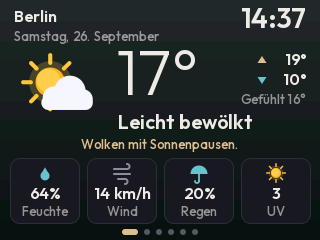 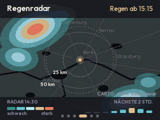
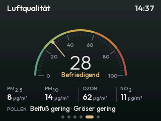 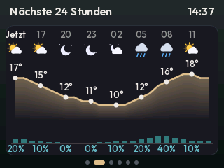
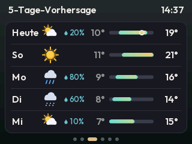 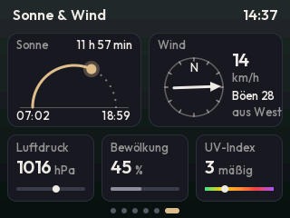

*Die Bilder stammen direkt aus dem Firmware-Code (Host-Simulator, siehe unten).*

## Funktionen

- **6 Ansichten:** Jetzt · Nächste 24 Stunden · 5-Tage-Vorhersage · Regenradar · Luftqualität · Sonne & Wind
- **Regenradar:** Karte mit etwa 100 km Umkreis, aktuelles Radarbild, „Regen ab 15:15“ und Regenbalken für die nächsten 2 Stunden
- **Luftqualität:** Europäischer Luftqualitätsindex als Rundinstrument, Feinstaub PM2.5/PM10, Ozon, Stickstoffdioxid und Pollenflug (Europa)
- **Ort wechseln per Touch:** Stadtnamen antippen, bis zu 5 Orte merken, neue Orte über die Bildschirmtastatur suchen
- **Einrichtung per Handy:** WLAN, Passwort und erster Ort – kein Code anfassen
- Wetterdaten von [Open-Meteo](https://open-meteo.com) – kostenlos, **kein API-Schlüssel**, Aktualisierung alle 10 Minuten
- Graphit-Hintergrund, leicht getönt nach Wetterlage und Tageszeit
- Uhrzeit per NTP inkl. Sommerzeit, deutsches Datum
- Nachts automatisch gedimmt (beim Antippen kurz hell)
- Nach 60 s ohne Berührung zurück zur Hauptansicht
- Flimmerfreies Zeichnen über einen Streifen-Puffer (nur 38 KB RAM)
- Umlaute und `°` in allen Schriften (Outfit, SIL Open Font License)

| Sonnig | Regen | Gewitter | Schnee | Nacht |
|---|---|---|---|---|
| 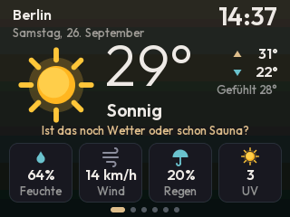 | 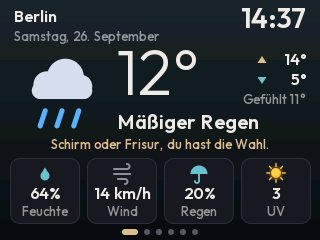 | 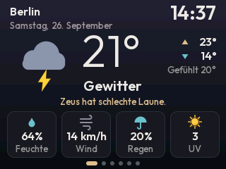 | 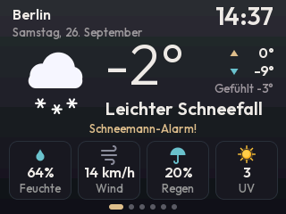 | 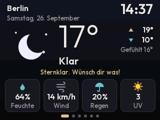 |

## Installation (ohne Programmieren)

### 1. Firmware herunterladen
Unter **[Releases → Aktuelle Firmware](../../releases/tag/firmware)** die passende Datei laden. Testversionen aus anderen Branches liegen als eigene Vorabversion unter „Test-Firmware (…)“ bei den Releases.
- `cyd-wetter-cyd.bin` – CYD mit **einem** Micro-USB-Anschluss
- `cyd-wetter-cyd2usb.bin` – CYD mit **USB-C und Micro-USB**

### 2. Im Browser flashen (Chrome, Chromium oder Edge)
1. CYD per USB anschließen (Datenkabel!).
2. <https://espressif.github.io/esptool-js/> öffnen.
3. Baudrate **921600**, auf **Connect** klicken und den Port wählen (Linux: `ttyUSB0`, Windows: `COM…`).
4. Bei **Flash Address** `0x0` eintragen, die `.bin`-Datei auswählen.
5. **Program** klicken und warten, bis „Leaving…“ erscheint. Dann die **RST**-Taste am CYD drücken.

> Linux (Ubuntu, Zorin, Mint …) einmalig vorbereiten:
> `sudo apt remove brltty && sudo usermod -aG dialout $USER`, danach neu anmelden.

### 3. WLAN und Stadt einrichten (per Handy)
1. Das CYD zeigt „Einrichtung“ und öffnet ein eigenes WLAN **CYD-Wetter**.
2. Handy mit diesem WLAN verbinden – die Einrichtungsseite öffnet sich (sonst `192.168.4.1` im Browser).
3. **Configure WiFi** → dein WLAN wählen, Passwort und **Stadt** eintragen → **Save**.
4. Das CYD verbindet sich, sucht den Ort und zeigt das Wetter.

Passwort und Orte werden nur auf dem Gerät gespeichert.

### 4. Ort wechseln
**Stadtnamen oben links antippen.** Es erscheinen deine gespeicherten Orte:
- Ort antippen = dorthin wechseln, lange drücken = aus der Liste löschen
- **+ Ort suchen** öffnet die Tastatur. Namen tippen, **Suchen**, Treffer antippen – fertig. Die Taste **ÄÖÜ** schaltet auf Umlaute und Ziffern um.
- **WLAN ändern** öffnet wieder die Einrichtung per Handy (geht auch: Stadtnamen 2 Sekunden gedrückt halten)

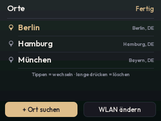 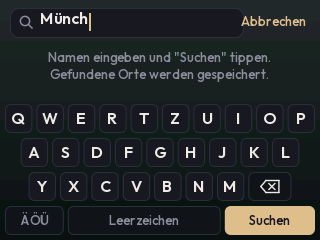 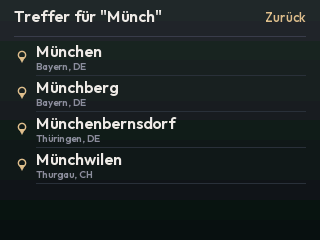

### Selbst kompilieren (optional)
1. [VS Code](https://code.visualstudio.com/) + Erweiterung **PlatformIO IDE** installieren und dieses Repository öffnen.
2. Optional `include/config.h` anpassen (Zeitzone, Helligkeit, Geburtstag, Ton …).
3. In PlatformIO die Umgebung `cyd` oder `cyd2usb` wählen und **Upload** klicken – oder im Terminal `pio run -e cyd -t upload`.

Jeder Push baut die Firmware außerdem automatisch per GitHub Actions und aktualisiert das Release.

## Bedienung

| Geste | Wirkung |
|---|---|
| Nach links/rechts wischen | nächste / vorige Ansicht |
| Linkes / rechtes Drittel antippen | vorige / nächste Ansicht |
| Punkte unten | zeigen, wo du bist |
| Stadtnamen antippen | Orte wechseln, suchen, löschen |
| Stadtnamen 2 s gedrückt halten | WLAN ändern (Einrichtung per Handy) |

## Easter Eggs

<details>
<summary><b>Spoiler! Erst selbst suchen?</b></summary>

| | Auslöser | Was passiert |
|---|---|---|
| 🐸 **Wetterfrosch** | 5× schnell aufs Wettersymbol tippen | Der Frosch klettert die Leiter hoch – je besser das Wetter, desto höher – und gibt eine Bauernregel zum Besten |
| 💧 **Tropfenfänger** | Uhrzeit 2 s gedrückt halten | Minispiel: Regentropfen mit dem Eimer fangen (Finger steuert), Sonnen = +5, Blitze kosten ein Leben. Highscore bleibt gespeichert |
| 🟩 **Matrix-Wetter** | Ecken antippen: oben rechts → unten rechts → unten links → oben links | Grüner Zeichenregen mit „Wake up, Neo …“ |
| 🕜 **Leet Time** | um 13:37 Uhr | Die Uhr leuchtet grün und flackert |
| 🍬 **Unwetterwarnung** | am 1. April | „Ab 14 Uhr regnet es Gummibärchen.“ … April, April! |
| 🎅 **Feiertage** | 24.–26.12. / 31.10. / Neujahr 0:00 | Weihnachtsmütze aufs Wettersymbol, Kürbis neben der Stadt, Feuerwerk |
| 🎂 **Geburtstag** | `BIRTHDAY_*` in `config.h` setzen | Konfetti, Glückwunsch und „Happy Birthday“ aus dem Lautsprecher |
| 😄 **Flachwitz** | BOOT-Taste kurz drücken | Zufälliger (Wetter-)Flachwitz, nochmal drücken = nächster |
| 🪩 **Disco-Wetter** | BOOT-Taste 1 s halten | RGB-LED blinkt bunt, das Display pulsiert, der Lautsprecher dudelt |
| 👀 **Licht aus** | Lichtsensor vorne abdecken | „Huch! Wer hat das Licht ausgemacht?“ |
| 💬 **Sprüche** | immer | Unter der Wetterlage steht ein passender Spruch |

 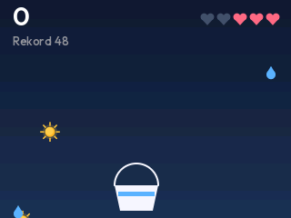 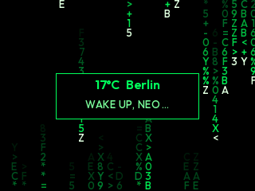
 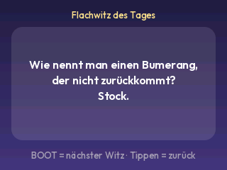 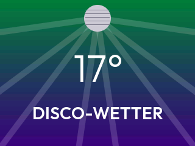
  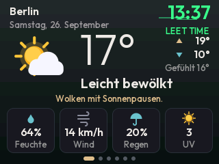

</details>

## Fehlersuche

| Problem | Lösung |
|---|---|
| Farben falsch / invertiert | andere Umgebung (`cyd` ↔ `cyd2usb`) probieren oder in `platformio.ini` `-DTFT_INVERSION_ON=1` bzw. `OFF` tauschen |
| Bild gespiegelt oder weiß | Umgebung `cyd2usb` testen; bei manchen Boards hilft `-DSPI_FREQUENCY=40000000` |
| Tipps landen daneben | `TOUCH_DEBUG true` setzen, Rohwerte im seriellen Monitor ablesen und `TOUCH_X/Y_MIN/MAX` anpassen; ggf. `TOUCH_FLIP_X/Y` |
| Einrichtung meldet „Verbindung fehlgeschlagen“ | Passwort prüfen – der ESP32 kann nur **2,4-GHz**-WLAN |
| „Ort nicht gefunden“ | Nur den Ortsnamen eingeben, z. B. `Leipzig` oder `Bad Honnef` |
| Radar zeigt „Zu wenig Speicher“ | Einmal neu starten (RST); das Radar braucht rund 80 KB am Stück |
| Radar bleibt leer | RainViewer/CARTO nicht erreichbar – das Gerät versucht es alle 2 Minuten erneut |
| Board wird beim Flashen nicht gefunden | Datenkabel verwenden; Linux: `brltty` entfernen, Gruppe `dialout` (siehe oben) |
| Lautsprecher zu nervig | `SOUND_ENABLED false` |
| „Licht aus“ löst zu oft / nie aus | `LDR_DARK_DELTA` anpassen oder `LDR_EGG_ENABLED false` |

## Projektstruktur

```
include/config.h      Deine Einstellungen
src/main.cpp          Einrichtung (WLAN + Ort), Ortswahl, Zeit, Abrufe, Navigation, Dimmen
src/net.cpp           HTTPS-Abrufe, Radar- und Kartenkacheln (PNG), Luft, Ortssuche
src/ui.cpp            Alle Ansichten, Ortswahl und Tastatur, Startbildschirm
src/air.cpp           Luftqualität und Pollen (Open-Meteo)
src/radar.cpp         Kachel-Mathematik, Radarfarben -> Regenstufen
src/icons.cpp         Gezeichnete Wettersymbole
src/gfx.cpp           Streifen-Rendering, kantengeglättete Formen, Text
src/weather.cpp       Open-Meteo-Parser, WMO-Codes → deutsche Texte, Sprüche
src/eggs.cpp          Alle Easter Eggs
src/input.cpp         Touch-Gesten und BOOT-Taste
src/hw.cpp            RGB-LED, Lautsprecher, Lichtsensor, Speicher
src/fonts/            Erzeugte Schriften (tools/make_fonts.py)
sim/                  Host-Simulator für Screenshots
```

## Schriften neu erzeugen

```
pip install pillow
python3 tools/make_fonts.py
```

Größen, Gewichte und Zeichensatz stehen oben im Skript.

## Simulator

`sim/run.sh` kompiliert den Zeichen-Code der Firmware (UI, Symbole, Easter Eggs, JSON-Parser) für den PC gegen eine kleine TFT_eSPI-Nachbildung und schreibt Screenshots nach `sim/build/`. Radar und Luft verwenden dabei Beispieldaten (`sim/make_radar.py`, `sim/make_air.py`). Voraussetzung: `g++`, Python mit Pillow und die [ArduinoJson](https://github.com/bblanchon/ArduinoJson)-Quellen (Pfad per `ARDUINOJSON=.../src`).

## Datenquellen

- Wetter, Luftqualität, Pollen, Ortssuche: [Open-Meteo](https://open-meteo.com) (CC BY 4.0)
- Radar: [RainViewer](https://www.rainviewer.com/api.html)
- Karte: © [CARTO](https://carto.com/attributions), © [OpenStreetMap](https://www.openstreetmap.org/copyright)-Mitwirkende

## Lizenz

Code: MIT. Schrift Outfit: SIL Open Font License (`tools/Outfit-OFL.txt`).
